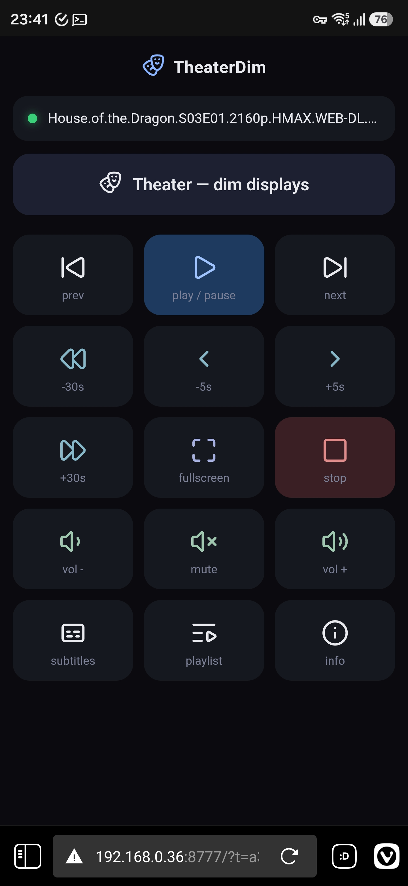

# TheaterDim

A tiny Windows tray app for **PotPlayer**. Two things:

1. **Theater dimming** — dims every monitor *except* the one PotPlayer is playing on. Automatically when PotPlayer goes fullscreen, or on demand via hotkey / phone / tray. Auto-detects any number of monitors (2, 3, …).
2. **Phone remote** — a small web page on your LAN (token-protected). Play/pause, volume, seek, fullscreen, subtitles, and a **Theater** button — all from your phone's browser. Nothing to install on the phone.

One process, one tray icon. Survives restart.

<p align="center">
  
  <br><em>The phone remote: live media title + a Theater button to dim the other monitors.</em>
</p>

---

## Install

> Needs Windows 10/11 (x64) and [PotPlayer](https://potplayer.daum.net/).

### Easiest — prebuilt (no .NET, no build) ✅ recommended for non-devs

1. Go to **[Releases](../../releases/latest)** → download **`TheaterDim-win-x64.zip`**.
2. Unzip, then **double-click `Install.bat`**.
3. If Windows shows *"Windows protected your PC"* → **More info ▸ Run anyway** (the app is unsigned, that's expected).
4. Click **Yes** on the UAC prompt (it adds the firewall rule for the phone remote).

Done — the exe is copied to `%LOCALAPPDATA%\TheaterDim`, registered to start at logon, and launched. You can delete the unzipped folder.

### From source (for devs)

1. **Code ▸ Download ZIP** (or `git clone`), unzip.
2. Double-click **`Install.bat`**. With no prebuilt exe present it auto-installs the .NET 9 SDK (winget) and builds a self-contained exe, then installs as above.

### Uninstall

Double-click **`Uninstall.bat`** (removes the task, firewall rule, and installed exe).

That's it. The installer:
- builds a standalone `TheaterDim.exe` (no .NET needed afterwards),
- registers a hidden **logon task** so it starts every time you log in,
- opens the LAN port on the firewall,
- starts it, and prints your **phone URL**.

### First use
- **Tray icon**: a clapperboard. Win11 hides new tray icons — click the **`^` overflow** near the clock, then drag it onto the taskbar to pin.
- **Hotkey**: `Ctrl+Alt+T` toggles the dim from anywhere.
- **Phone**: same Wi-Fi → open the printed `http://<pc-ip>:8777/?t=<token>` (also shown in tray ▸ Web remote ▸ Show phone URL).
- Right-click the tray icon for dim level, auto-follow vs manual main display, and remote settings.

### Uninstall
**Right-click `uninstall.ps1` ▸ Run with PowerShell.** Removes the task + firewall rule.

---

## How it works

| Part | Tech |
|------|------|
| Tray + overlays | C# .NET 9 WinForms — `NotifyIcon` + one click-through layered `Form` per monitor |
| Fullscreen / monitor detect | Win32 `GetForegroundWindow` + `GetWindowRect` vs `Screen.Bounds`, 300 ms poll |
| Web remote | raw `TcpListener` HTTP (no admin/urlacl), token-gated, background thread |
| PotPlayer control | `SendMessage(hwnd, WM_COMMAND, id, 0)` to window class `PotPlayer64` — no focus needed |
| Hotkey | `RegisterHotKey` on a hidden message window |
| Remote UI | one self-contained HTML page, inline Lucide SVG icons, vanilla JS |

### Security
The remote controls the PC, so every request needs `?t=<token>` (random, generated on first run, stored in `%APPDATA%\TheaterDim\settings.json`). The server binds all interfaces — works over LAN and Tailscale. Keep the URL private; regenerate the token any time from the tray menu.

## PotPlayer control reference

`SendMessage(hWnd, 0x0111 /*WM_COMMAND*/, ID, 0)` — target window class `PotPlayer64`.

| Action | ID | Action | ID |
|--------|------|--------|------|
| Play/Pause toggle | 10014 | Volume Up | 10035 |
| Play | 20001 | Volume Down | 10036 |
| Pause | 20000 | Toggle Mute | 10037 |
| Stop | 20002 | Next | 10124 |
| Previous | 10123 | Toggle Subtitles | 10126 |
| Open File | 10158 | Toggle Playlist | 10011 |
| Fullscreen | 10013 | Toggle OSD/info | 10351 |
| Seek −5s | 10059 | Seek +5s | 10060 |
| Seek −30s | 10061 | Seek +30s | 10062 |

Sources: AutoHotkey PotPlayer x64 library; Unified Remote PotPlayer remote.lua.

## Dev build / run

```powershell
dotnet run -c Release            # run from source
dotnet build -c Release          # just compile
```

Autostart task management:
```powershell
Start-ScheduledTask TheaterDim
Get-ScheduledTask  TheaterDim                       # State should be Running
Unregister-ScheduledTask TheaterDim -Confirm:$false # remove
```

## Roadmap

- [x] Multi-monitor dimming (auto-follow + manual main display)
- [x] Web remote (play/pause, vol ±, seek ±5/±30, fullscreen, subs, playlist) with token auth
- [x] Live status on phone (PotPlayer running + media title)
- [x] Custom tray icon + Lucide-icon mobile UI
- [x] Global hotkey `Ctrl+Alt+T`
- [x] Single-instance guard, logon autostart, one-shot installer
- [x] QR code in tray (Web remote ▸ Show phone URL / QR) — scan to open on phone
- [ ] Live volume / seek-bar state via SSE
